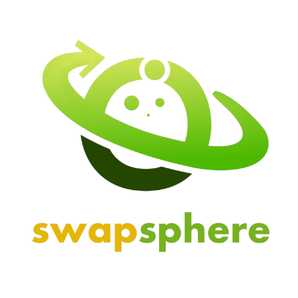
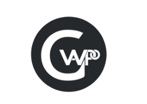

<h1 align="center">
   
  Swapsphere Document Portfolio
</h1>

<

  Welcome to the SwapSphere Document Portfolio repository! This repository contains comprehensive documentation and resources for the **SwapSphere** app design prototype.

<h2 align="center">Contents</h2>

- **Assets:** Contains assets used for this repository. 
- **Team Certificates:** Certificates of the team members. 
- **User Manual:** Guide to navigating and maximizing the features of our app prototype. 
- **Part 1:** Initial phase documents. 
- **Part 2:** Second phase documents. 
- **Part 3:** Third phase documents. 
- **Part 4:** Final phase and completion documents. 

  

<h3 align="center">Team Gwapo</h3>

- Jeddh Andrew Jayme ([GitHub](https://github.com/LUSIENTOO)) 
- Nokie Pabualan ([GitHub](https://github.com/Yasinans)) 

